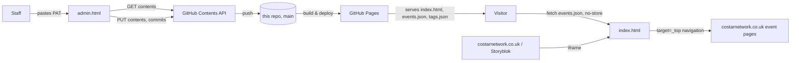

# Architecture

## Data flow



## Why this architecture

- The host CMS supports iframe embeds but not custom calendar logic, so
  the calendar is built as an independently-hosted static page rather than
  a CMS component.
- No server/database was available or required, so GitHub itself serves as
  both the datastore (via the Contents API) and the hosting/CDN layer
  (Pages). Every write is a real commit — versioning and rollback come for
  free via `git log`/revert, with no additional tooling.
- No framework or bundler: each HTML file is self-contained (inline
  CSS/JS). Zero install step, zero supply-chain surface, trivially
  portable to any static host if GitHub Pages is ever outgrown.

---

## Public calendar (`index.html`)

### Month grid generation

A fixed 6×7 (42-cell) grid is rendered for every month, regardless of
actual month length, so the iframe's height stays constant across month
navigation. Built by exploiting `Date`'s automatic month rollover:

```js
const cellDate = new Date(y, m, i - firstWeekday + 1); // i in [0, 42)
```

`i - firstWeekday + 1` is allowed to go negative or beyond the month's day
count; `Date` normalises this into the correct adjacent-month date without
manual boundary arithmetic.

### Event-to-day mapping

`buildEventMap()` produces a `Map<'YYYY-MM-DD', Event[]>`. Single-day
events key directly off `date`. `startDate`/`endDate` ranges are expanded
by iterating one day at a time (capped at 90 iterations as a sanity bound
against malformed input) and added to every day in range.

### Two independent colour systems

- **Lab colour** (`LAB_COLOURS`): a fixed string→colour map. Drives the
  grid pill background and the day-list dot. One lab, one deterministic
  brand colour — a lookup, not a hash, because the mapping is a fixed
  business requirement (six known labs) rather than open-ended.
- **Tag colour** (`TAG_PALETTE` + `hashStr`): deterministic hash-based
  assignment from a small fixed palette. Drives the filter bar chips and
  the tag badges inside the event detail card. Hash-based because tags are
  open-ended — staff can add new ones via `admin.html` with no code
  change — and aren't 1:1 with a lab, so a fixed map isn't appropriate
  here. A new tag gets a stable, consistent colour automatically.

These two systems are deliberately not unified: an event's *identity* on
the grid is its lab; an event's *tags* are an orthogonal, filterable
property that can span multiple labs.

### Filtering

`activeTags: Set<string>`. Empty set = show all events. Non-empty = show
events whose `tags` array intersects the set (OR semantics across
selected tags, not AND). Filtering is applied per-day at render time
(`visibleEventsFor`), upstream of the existing "N visible + (+X more)"
logic, which otherwise runs unchanged against the filtered list.

### Modal

A single backdrop/container with two render modes, rather than two
separate components:

- **Day-list mode** (`openDayModal`) — triggered by "+N more", or (on
  narrow viewports) tapping a day cell with multiple events. Lists events
  for that day.
- **Event-detail mode** (`openEventModal`) — triggered by any pill, or by
  a day-list item, in which case a "← Back" control returns to day-list
  mode. This is tracked via the `cameFromKey` parameter passed into
  `openEventModal`, not via separate DOM state.

### Rendering safety rules

All event-derived text is inserted via `escapeHtml`/`escapeAttr` before
reaching the DOM, including the event `id` used in `data-*` attributes
(see `SECURITY.md` — this was a gap, now closed). The event-detail CTA
only renders as a real `<a href>` if `ev.url` matches `/^https?:\/\//i`;
otherwise an inert placeholder renders instead. All outbound links use
`target="_top" rel="noopener"`, so a click navigates the parent page (not
the iframe) without exposing `window.opener` to the destination.

### Embedding contract

`notifyHeight()` posts `{ type: "costar-calendar-resize", height }` to
`window.parent` on every render and modal open, for host pages that want
to auto-size the iframe. This is best-effort only — nothing on the
calendar side depends on the host consuming it, and a fixed-height iframe
works fine without it.

---

## Admin interface (`admin.html`)

### Auth model

A GitHub fine-grained PAT (Contents: Read/write, scoped to this repo
only), supplied by the user and kept only in `sessionStorage` for the
tab's lifetime — never written to any file, never sent anywhere except
`api.github.com`. "Connect" validates the token with a single `GET`;
write permission is only exercised — and can only fail — on first save
(see `SECURITY.md` for why this produces a specific, common failure mode).

### GitHub Contents API read-modify-write

Two generic helpers wrap the Contents API:

- `githubGetFile(path, token)` → `GET .../contents/{path}`, base64-decodes
  via `TextDecoder` (not the legacy `atob(unescape(...))` idiom, to handle
  non-ASCII content correctly).
- `githubPutFile(path, token, data, sha, message)` → `PUT
  .../contents/{path}`, base64-encodes via `TextEncoder`.

Every mutation follows: re-fetch file + current `sha` → mutate in memory →
write with that `sha`. The `sha` is always re-fetched immediately before
writing rather than reused from an earlier page load, to minimise (not
eliminate) lost-update races between concurrent admin sessions. A stale
`sha` is rejected by GitHub as `409`, surfaced to the user as "someone
else may have just saved — try again" rather than silently overwritten.

`fetchTagsFile` treats a `404` on `tags.json` as "doesn't exist yet" and
returns an in-memory default list with `sha: null`. `githubPutFile` omits
the `sha` field from the request body entirely when `null` — this is what
signals the Contents API to create the file rather than update it.

### Error messaging

`describeApiError(status)` centralises HTTP status → human-readable
message. Notably, a bare `403` is mapped to an explicit "check your token
has Contents: Read and write" hint — in practice the most common failure
mode, since a read-only token passes "Connect" (a `GET`) and only fails on
the first write.

### Event CRUD

Form → validate → read-modify-write → re-render. `cleanEvent()` normalises
*every* event object on *every* write (ensures `id`/`tags`/`lab` are
always present, strips unused date fields), including events untouched by
the current operation — so the whole file self-normalises over time
regardless of whether an entry originated from the form or a hand-edit.

### Tag CRUD and the catalog/usage-union model

`tags.json` is a **suggestion catalog**, not the source of truth for which
tags exist. The authoritative set for filtering and display on the public
calendar is always derived live from `events.json`. Accordingly, the admin
tag manager renders the **union** of `tags.json` entries and tags actually
found in use across `events.json` — so a tag present only in event data
(e.g. from a hand-edit) is still visible/manageable, and a catalog-only
tag with zero events is still offered in the event form.

Rename and delete write `events.json` first, then `tags.json` — in that
order because `events.json` is what the public calendar actually reads.
If the second write fails after the first succeeds, public-facing
behaviour is already correct; the catalog is merely stale until next
touched (self-healing via the union model above — not a correctness bug,
but worth knowing if the two files are ever observed out of sync).

### Validation boundary

All validation in `admin.html` — required fields, URL scheme, date
ordering, the costarnetwork.co.uk domain check — is client-side UX
guidance, not a security boundary. Anyone holding a valid token can call
the GitHub API directly and bypass all of it. See `SECURITY.md`.

---

## Known trade-offs

(Short version in `README.md`.)

- Two-file consistency (`events.json`/`tags.json`) is maintained via the
  union/self-healing model above, not a transaction. Acceptable at current
  scale and write frequency; would need revisiting (a single combined
  file, or real transactional semantics) if concurrent admin usage becomes
  frequent.
- No automated test suite; development relied on manual in-browser QA and
  Node's `--check` for syntax validation only.
- `id`s are `Date.now()` + `Math.random()`, not UUIDs — negligible
  collision probability at expected volumes, non-zero in principle.
